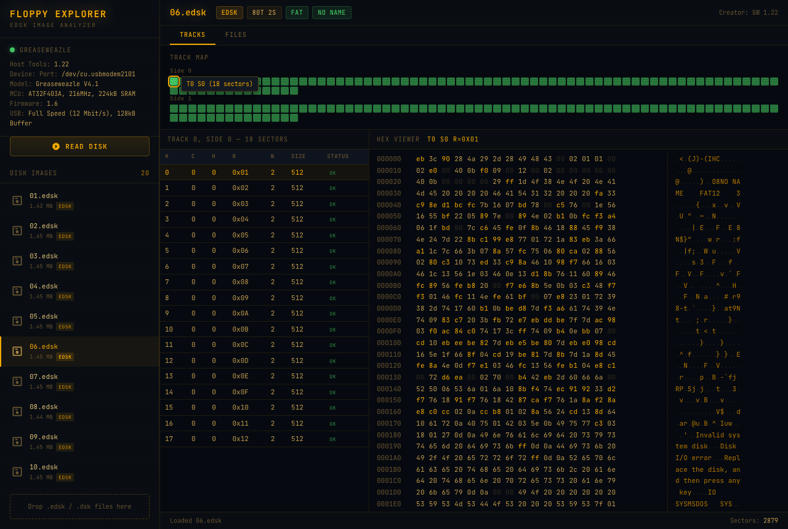
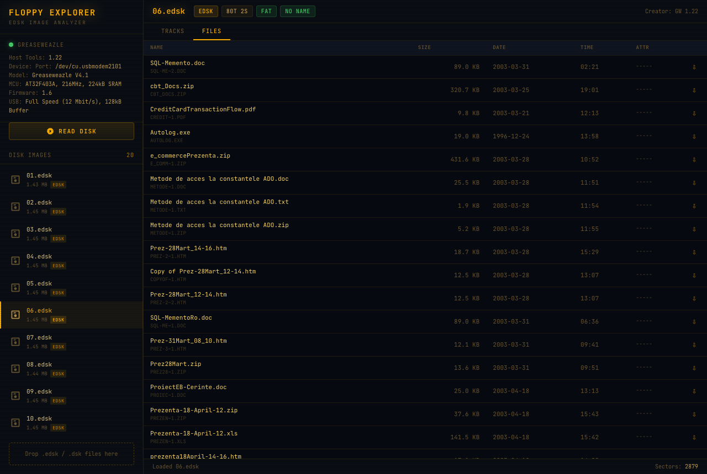

# Floppy Explorer

A retro-styled EDSK floppy disk image explorer with live [Greaseweazle](https://github.com/keirf/greaseweazle) hardware integration. Built for archivists, retrocomputing enthusiasts, and anyone who still has a box of floppies.

  

---

## Features

### Disk Image Analysis
- **EDSK & DSK format support** — full parsing of Extended CPC Disk and standard DSK images
- **Track map visualization** — color-coded grid showing disk health at a glance (green = OK, yellow = errors, red = truncated, dark = missing)
- **Sector inspector** — detailed CHRN values, FDC status flags (ST1/ST2), error breakdowns per sector
- **Hex viewer** — full sector hex dump with ASCII column, color-highlighted zero bytes and high bytes

### Filesystem Support
- **FAT12 detection** — automatic BPB parsing from boot sector (OEM, cluster size, media descriptor, volume label)
- **Directory browser** — file listing with sizes, dates, and attributes
- **VFAT long filename (LFN) support** — full reconstruction of Windows 95+ long filenames from LFN entries
- **File extraction** — download individual files directly from FAT12 disk images
- **CPC/CP/M detection** — identifies Amstrad CPC disks by sector ID patterns

### Greaseweazle Integration
- **Live device status** — shows connected Greaseweazle model, firmware version, USB speed
- **Read disks from the UI** — start a disk read with format/track/revision options, watch progress in real-time via WebSocket
- **RPM measurement** — check drive motor speed
- **Process safety** — OS-level `pgrep` check prevents conflicts with background `gw` operations running in your terminal

### Disk Library
- **Drag & drop upload** — drop `.edsk`, `.dsk`, `.img`, or `.ima` files into the sidebar
- **Persistent library** — disk images stored in the `disks/` directory
- **Auto-parse on load** — format, track count, sides, and filesystem detected automatically
- **Delete from UI** — remove disk images you no longer need

### Desktop App
- **Neutralinojs wrapper** — lightweight native window (~2MB vs Electron's ~150MB)
- **Also works as a web app** — just run `npm start` and open your browser

---

## Screenshots

**Sector inspector & hex viewer** — track map, CHRN values, FDC status flags, and full hex dump with ASCII column.



**File browser** — FAT12 directory listing with VFAT long filenames and 8.3 SFN aliases, with one-click file extraction.



The UI uses an **amber CRT aesthetic** — warm phosphor tones on dark backgrounds with a JetBrains Mono monospace font and subtle scanline overlay.

---

## Quick Start

### Prerequisites
- **Node.js** >= 18
- **Greaseweazle** `gw` CLI (optional, for hardware features) — [install guide](https://github.com/keirf/greaseweazle/wiki/Installation)

### Run as web app
```bash
npm install
npm start
# Open http://localhost:3141
```

### Run as desktop app
```bash
npm install -g @neutralinojs/neu
neu update --latest
npm run desktop
```

### Build for distribution
```bash
neu build --release
# Output in dist/floppy-explorer/
```

---

## Usage

1. **Add disk images** — drop `.edsk` / `.dsk` files into the sidebar, or place them in the `disks/` directory
2. **Browse tracks** — click a disk to see the track map and sector table
3. **Inspect sectors** — click any sector row to view its hex dump
4. **Browse files** — switch to the Files tab on FAT12 disks to see directory contents
5. **Download files** — click the arrow icon next to any file to extract it
6. **Read a floppy** — connect a Greaseweazle, click "Read Disk", choose your settings

---

## Project Structure

```
floppy-explorer/
  server.js              # HTTP + WebSocket server (port 3141)
  lib/
    edsk-parser.js       # EDSK/DSK format parser, FAT12 reader
    greaseweazle.js      # gw CLI wrapper with process safety
  ui/
    index.html           # Single-file frontend (CSS + JS inline)
    loading.html         # Neutralinojs splash screen
  extensions/
    server/main.js       # Neutralinojs Node.js extension
  disks/                 # Your disk images (gitignored)
  edsk.js                # Original CLI parser tool
  neutralino.config.json # Desktop app configuration
```

---

## API

The server exposes a JSON API on port 3141:

| Endpoint | Description |
|---|---|
| `GET /api/disks` | List all disk images with metadata |
| `GET /api/disk/:name` | Full disk info (tracks, sectors, filesystem) |
| `GET /api/disk/:name/sector?track=&side=&r=` | Hex dump of a single sector |
| `GET /api/disk/:name/files` | FAT12 directory listing |
| `GET /api/disk/:name/download?cluster=&size=&name=` | Download a file from disk |
| `GET /api/gw/info` | Greaseweazle device info |
| `GET /api/gw/rpm` | Drive RPM measurement |
| `DELETE /api/disk/:name` | Delete a disk image |
| `POST /upload` | Upload disk images (multipart) |

WebSocket on the same port supports `read-disk`, `cancel-read`, and `gw-info` commands for live operations.

---

## Supported Formats

| Format | Extension | Notes |
|---|---|---|
| Extended CPC DSK | `.edsk` | Full support including variable sector sizes |
| Standard CPC DSK | `.dsk` | Fixed sector size format |
| Raw disk images | `.img`, `.ima` | Upload supported, limited parsing |

Filesystem detection: **FAT12** (with VFAT LFN), **CPC/CP/M** (identification only).

---

## Releases

Automated builds are published via GitHub Actions when a version tag is pushed:

```bash
git tag v0.1.0
git push origin v0.1.0
```

This produces downloadable `.zip` archives for:
- macOS arm64 (Apple Silicon)
- macOS x64 (Intel)
- macOS universal
- Windows x64

### Note for macOS users

Mac builds are **not notarized**. macOS will block the app on first launch. To fix this, run in Terminal:

```bash
xattr -r -d com.apple.quarantine "/Applications/Floppy Explorer.app"
```

This resolves the errors:
- *"Floppy Explorer.app" is damaged and can't be opened*
- *Apple could not verify "Floppy Explorer.app" is free of malware*

---

## License

GPL-3.0 — see [LICENSE](LICENSE) for details.

---

Built with Node.js, [Neutralinojs](https://neutralino.js.org), and a love for old floppies.
